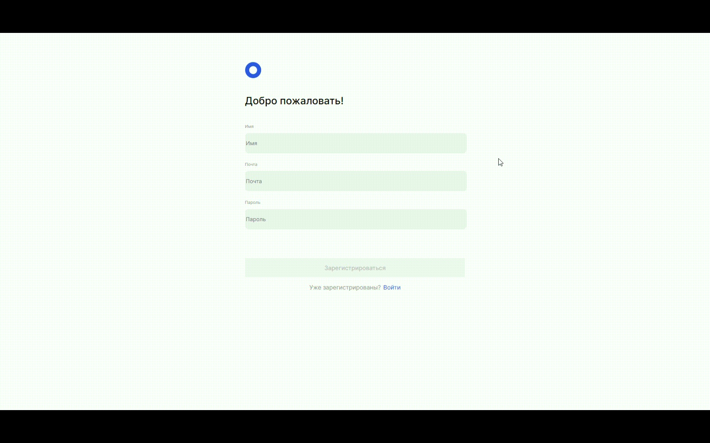
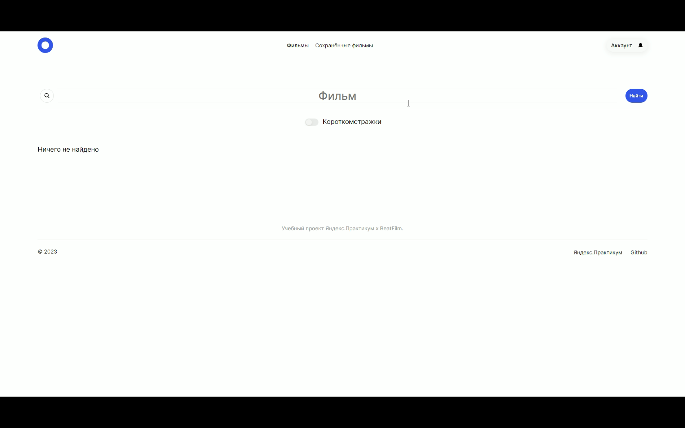
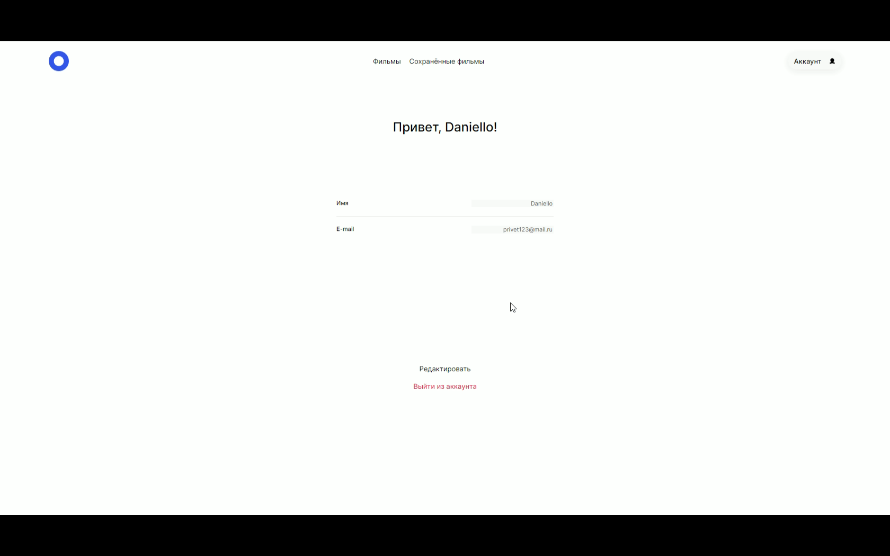

<h1 align="center">Graduation project!</h1>

## Test

- **Copy this <a href="https://github.com/DanielloXXI/movies-explorer-frontend">frontend</a> repo and this <a href="https://github.com/DanielloXXI/movies-explorer-backend">backend</a> repo** 
- **Try command "npm install", "npm run start" for frontend and "npm install", "npm run dev" for backend** 
- **Wait... and... Congratulations!**

## Description

You can learn a little about me! The project supports registration, authorization, allows you to add movies to your saved.

## Figma

https://www.figma.com/file/Ev9jRwc5tZ3TZToW9T1PvI/Diploma-(Copy)?type=design&node-id=37056%3A26094&mode=dev

## Used technologies: 

- **CSS BEM** 
- **HTML** 
- **React**
- **JS**
- **ExpressJS**
- **MongoDB**

## Registration

### Sign up for your account on our website!

- **Enter email** 
- **Enter Password** 
- **Enter Name** 
- **Get a successful registration!**

### **Congratulations!**

## Find and add film to your library

## Change your name and email!

## Are you leaving already? 

